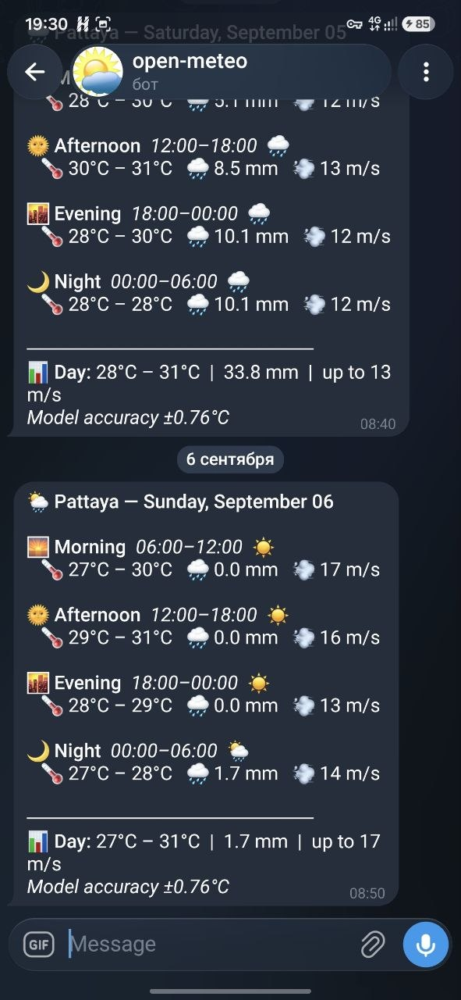

# Pattaya Weather Forecast ML

XGBoost models predicting temperature, precipitation, and wind speed 24 hours ahead for Pattaya, Thailand, using the [Open-Meteo API](https://open-meteo.com/) (no API key required).

A Telegram bot sends a daily morning forecast broken down by time of day (Morning / Afternoon / Evening / Night) via GitHub Actions — no VPS or server required.



---

## How it works

```
Open-Meteo API
      │
      ▼
GitHub Actions (daily 07:23 Pattaya time)
      │
      ├─ fetch_data()      — past 8 days + 2-day forecast (no DB needed)
      ├─ build_features()  — 50 engineered features
      ├─ model.predict()   — 3 XGBoost models (temp / precip / wind)
      └─ send_telegram()   — HTML message to bot
```

The scheduled run uses `src/run_forecast.py` — a self-contained script that fetches data, builds features, loads the committed model files, and sends the Telegram message. No SQLite, no server, no .env file needed on the runner.

---

## Models

| Target | Model | Key metric | Notes |
|--------|-------|-----------|-------|
| Temperature 24h | XGBRegressor | MAE 0.76°C, R²=0.86 | Production gate: MAE < 2.0°C |
| Precipitation 24h | Two-stage (XGBClassifier + XGBRegressor) | AUC 0.745 | Handles heavy zero-inflation |
| Wind speed 24h | XGBRegressor | MAE 3.1 m/s | Difficult 24h horizon |

### Why two-stage for precipitation?

Most hourly readings are 0 mm. A single regressor minimises MSE by predicting near-zero for everything. The two-stage pipeline fixes this:

- **Stage 1 — XGBClassifier**: predicts P(rain > 0.5 mm), trained with `scale_pos_weight` to compensate for the imbalance (AUC=0.745)
- **Stage 2 — XGBRegressor**: predicts amount in mm, trained only on rainy hours
- **Combined**: `output = amount if P(rain) > 0.30 else 0.0`

---

## Feature engineering (50 features)

| Group | Features |
|-------|---------|
| Temp lags | `temp_lag_1h/3h/6h/12h/24h` |
| Temp rolling | `temp_roll_mean/std × {6h, 24h, 168h}` |
| Temp delta | `temp_delta_1h/3h/6h` |
| Wind lags | `windspeed_lag_1h/3h/6h/12h/24h` |
| Precip lags | `precip_lag_1h/3h/6h/12h/24h` |
| Precip rolling | `precip_roll_sum_3h/6h/24h` |
| Pressure lags | `pressure_lag_1h/3h/6h` |
| **Pressure changes** | **`pressure_change_3h/6h/12h/24h`** (top rain predictor) |
| Humidity lags | `humidity_lag_1h/3h/6h/12h/24h` |
| Humidity rolling | `humidity_roll_mean_6h/24h` |
| Weather code | `weathercode_raw` |
| Cyclical time | `hour_sin/cos`, `month_sin/cos`, `dayofweek_sin/cos` |
| Flags | `is_weekend`, `is_daytime` |

Pressure and recent-rain persistence were identified in EDA (`notebooks/eda_pattaya.ipynb`) as the strongest precursors to precipitation for Pattaya (r = -0.092 for `pressure_change_3h`, r = +0.159 for `precip_rolling_3h`).

---

## Project structure

```
weather-forecast-ml/
├── .github/
│   └── workflows/
│       ├── forecast.yml        Daily 07:23 Pattaya forecast via GitHub Actions
│       └── deploy.yml          Auto-deploy to VPS on push (optional)
├── data/
│   ├── weather.db              SQLite — 20 years of hourly data (gitignored)
│   └── eda/                    EDA charts (gitignored)
├── models/
│   ├── xgb_temp.pkl            Temperature model (~2 MB)
│   ├── xgb_precip.pkl          Two-stage precipitation model
│   ├── xgb_windspeed.pkl       Wind speed model
│   └── metadata.json           Metrics + production_ready flag
├── notebooks/
│   └── eda_pattaya.ipynb       Exploratory data analysis
├── src/
│   ├── download_history.py     Fetch 20 years of data -> SQLite
│   ├── fetch_live.py           Update SQLite with latest actuals
│   ├── features.py             Shared feature engineering (50 features)
│   ├── models.py               TwoStagePrecipModel class
│   ├── train.py                Train 3 models + production gate
│   ├── predict.py              24h inference from SQLite
│   ├── run_forecast.py         Standalone GitHub Actions script (no SQLite)
│   ├── dashboard.py            Streamlit UI
│   ├── eda.py                  EDA script (source for notebook)
│   └── telegram_bot.py         Telegram sender helper
├── tests/
│   ├── test_features.py
│   └── test_predict.py
├── .env.example
├── requirements.txt
└── run_pipeline.sh
```

---

## Quickstart (local training)

```bash
# 1. Install dependencies
pip install -r requirements.txt

# 2. Copy environment config
cp .env.example .env

# 3. Download 20 years of historical data (~5-10 min first run)
python src/download_history.py

# 4. Train models (prints metrics + PASS/FAIL gate)
python src/train.py

# 5. Fetch live data and generate 24h forecast
python src/fetch_live.py
python src/predict.py

# 6. Optional: launch Streamlit dashboard
streamlit run src/dashboard.py

# 7. Optional: run EDA
python src/eda.py
```

---

## GitHub Actions — daily Telegram forecast

The forecast runs automatically every day at **07:23 Pattaya time** (00:23 UTC) via `.github/workflows/forecast.yml`. No VPS needed.

### Setup (one-time)

**Step 1 — Add GitHub Secrets**

Go to repo **Settings → Secrets and variables → Actions → New repository secret**:

| Secret | Value |
|--------|-------|
| `TELEGRAM_BOT_TOKEN` | Token from [@BotFather](https://t.me/BotFather) |
| `TELEGRAM_CHAT_ID` | Your chat ID (send `/start` to the bot, then check `getUpdates`) |

**Step 2 — Trigger manually to test**

Go to **Actions → Daily Forecast → Run workflow**.

The workflow checks out the repo (which includes the trained model `.pkl` files), fetches 8 days of live data from Open-Meteo, runs inference, and sends the Telegram message.

### Telegram message format

```
[icon] Pattaya — Saturday, June 07

[Morning icon] Morning   06:00-12:00   [condition]
   Temp: 18°C - 24°C   Precip: 0.0 mm   Wind: 7 m/s

[Afternoon icon] Afternoon   12:00-18:00   [condition]
   Temp: 26°C - 29°C   Precip: 1.5 mm   Wind: 11 m/s

[Evening icon] Evening   18:00-00:00   [condition]
   Temp: 21°C - 27°C   Precip: 0.0 mm   Wind: 9 m/s

[Night icon] Night   00:00-06:00   [condition]
   Temp: 18°C - 21°C   Precip: 0.0 mm   Wind: 8 m/s

---------------------
Day: 18°C - 29°C  |  1.5 mm  |  up to 11 m/s
Model accuracy +-0.76°C
```

---

## Exploratory Data Analysis

See `notebooks/eda_pattaya.ipynb` for the full analysis. Key findings (Pattaya, 2006-2026):

| Signal | Correlation with next-24h rain | Note |
|--------|-------------------------------|------|
| `precip_rolling_3h` | +0.159 | Current rain is the strongest predictor of more rain |
| `precip_rolling_6h` | +0.150 | Persistence signal, slightly weaker at 6h |
| `pressure` | -0.118 | Low pressure = wet air mass |
| `pressure_change_3h` | -0.092 | Falling pressure = rain coming |
| `humidity` | +0.052 | High humidity precedes rain |

Unlike Krasnodar's mid-latitude, frontal-system-driven rain (where multi-hour pressure trends dominate), Pattaya's tropical rain is more persistence-driven — recent rainfall predicts near-term rainfall more strongly than pressure trends do.

---

## Production gate

Training prints a clear result:

```
=================================================================
  PRODUCTION GATE: temp MAE = 0.760C  (threshold < 2.0C)
  -> PASS
=================================================================
```

`models/metadata.json` stores `production_ready: true/false` for programmatic checks.

---

## Changing city

Edit `.env`:
```
CITY=YourCity
LAT=<latitude>
LON=<longitude>
```

Re-run `download_history.py` and `train.py`. Update the GitHub Actions env vars in `forecast.yml`.

---

## Running tests

```bash
pytest tests/ -v
```

---

## Optional: VPS auto-deploy

See `.github/workflows/deploy.yml` — deploys to a VPS via SSH on every push to `main`.
Requires `VPS_HOST`, `VPS_USER`, `VPS_SSH_KEY` secrets.
