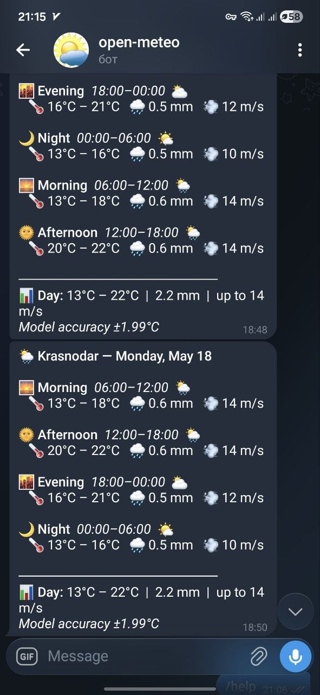

# Krasnodar Weather Forecast ML

XGBoost models predicting temperature, precipitation, and wind speed 24 hours ahead for Krasnodar, Russia, using the [Open-Meteo API](https://open-meteo.com/) (no API key required).



## Quickstart

```bash
# 1. Install dependencies
pip install -r requirements.txt

# 2. Copy and configure environment
cp .env.example .env
# Edit .env if you want a different city

# 3. Download 20 years of historical data (~5–10 min)
cd weather-forecast-ml
python src/download_history.py

# 4. Train models (prints metrics + production gate result)
python src/train.py
```

## Running predictions

```bash
# Fetch latest live data from Open-Meteo Forecast API
python src/fetch_live.py

# Generate 24h forecast table (saved to data/processed/latest_predictions.csv)
python src/predict.py
```

## Dashboard

```bash
streamlit run src/dashboard.py
```

Opens at `http://localhost:8501` with:
- Last 7 days actual temperature + predicted overlay
- 24h forecast table (temp, precipitation, wind)
- Model metrics in sidebar
- One-click refresh button

## Running tests

```bash
pytest tests/ -v
```

## Changing city

Edit `.env`:
```
CITY=YourCity
LAT=<latitude>
LON=<longitude>
```

Then re-run `download_history.py` and `train.py`.

## Automated hourly updates (cron)

```cron
# Every hour: fetch live data and update predictions
0 * * * * cd /path/to/weather-forecast-ml && bash run_pipeline.sh >> logs/pipeline.log 2>&1
```

## Phase 2 — Telegram daily forecast

After the production gate passes (temp MAE < 2.0°C), add your bot credentials to `.env`:
```
TELEGRAM_BOT_TOKEN=<your token from @BotFather>
TELEGRAM_CHAT_ID=<your chat or channel ID>
```

Send today's forecast:
```bash
python src/telegram_bot.py
```

Schedule daily at 07:00:
```cron
0 7 * * * cd /path/to/weather-forecast-ml && python src/telegram_bot.py >> logs/telegram.log 2>&1
```

## Deploy to VPS (GitHub Actions)

### How it works

```
git push origin main
       │
       └─► GitHub Actions
                │
                └─► SSH into VPS → git pull → pip install
```

Code updates deploy automatically on every push. Data and models stay on the VPS (not in git).

---

### Step 1 — Create GitHub repository

```bash
# in weather-forecast-ml/ on your local machine
git init
git add .
git commit -m "initial commit"
git remote add origin https://github.com/YOUR_USERNAME/YOUR_REPO.git
git push -u origin main
```

---

### Step 2 — Generate SSH key for GitHub Actions

Run on your **local machine** (or anywhere):

```bash
ssh-keygen -t ed25519 -C "github-actions-deploy" -f ~/.ssh/deploy_key -N ""
```

This creates two files:
- `~/.ssh/deploy_key` — **private key** (goes to GitHub Secrets)
- `~/.ssh/deploy_key.pub` — **public key** (goes to VPS)

---

### Step 3 — Add public key to VPS

```bash
# copy the public key content
cat ~/.ssh/deploy_key.pub

# on VPS — paste it into authorized_keys
echo "PASTE_PUBLIC_KEY_HERE" >> ~/.ssh/authorized_keys
chmod 600 ~/.ssh/authorized_keys
```

---

### Step 4 — Add GitHub Secrets

Go to your repo → **Settings → Secrets and variables → Actions → New repository secret**

| Secret name   | Value                                      |
|---------------|--------------------------------------------|
| `VPS_HOST`    | your VPS IP address (e.g. `185.10.20.30`) |
| `VPS_USER`    | SSH user (e.g. `root` or `ubuntu`)         |
| `VPS_SSH_KEY` | content of `~/.ssh/deploy_key` (private)   |

---

### Step 5 — First-time VPS setup (run once)

SSH into your VPS, then:

```bash
# clone and set up everything (downloads 20 years of data + trains models)
curl -fsSL https://raw.githubusercontent.com/YOUR_USERNAME/YOUR_REPO/main/scripts/vps_setup.sh | \
  bash -s -- https://github.com/YOUR_USERNAME/YOUR_REPO.git
```

Or manually:

```bash
git clone https://github.com/YOUR_USERNAME/YOUR_REPO.git /opt/weather-forecast-ml
cd /opt/weather-forecast-ml
bash scripts/vps_setup.sh https://github.com/YOUR_USERNAME/YOUR_REPO.git
```

The script:
1. Installs Python + git
2. Creates `.venv` and installs dependencies
3. Prompts to edit `.env` (add Telegram tokens)
4. Downloads 20 years of weather data (~10 min)
5. Trains models (~1 min)
6. Registers cron jobs (07:00 Telegram + hourly data fetch)

---

### Step 6 — Verify auto-deploy

Push any change to `main`:

```bash
git commit --allow-empty -m "test deploy"
git push origin main
```

Go to **GitHub → Actions** tab — you should see the deploy workflow run and succeed.

---

### Cron jobs on VPS (set by setup script)

```cron
# Daily Telegram forecast at 07:00
0 7 * * * cd /opt/weather-forecast-ml && .venv/bin/python src/telegram_bot.py >> logs/telegram.log 2>&1

# Hourly live data refresh
0 * * * * cd /opt/weather-forecast-ml && .venv/bin/python src/fetch_live.py >> logs/fetch.log 2>&1
```

Check or edit manually: `crontab -e`

---

## Production gate

Training prints a clear PASS/FAIL line:
```
PRODUCTION GATE: temp MAE = 1.87°C  (threshold < 2.0°C)
→ ✓  PASS
```

`models/metadata.json` stores `production_ready: true/false` for programmatic checks.

## Project structure

```
weather-forecast-ml/
├── data/raw/               Open-Meteo JSON cache (one file per year)
├── data/processed/         latest_predictions.csv
├── models/                 xgb_temp.pkl, xgb_precip.pkl, xgb_windspeed.pkl, metadata.json
├── src/
│   ├── download_history.py Fetch 20 years → SQLite
│   ├── fetch_live.py       Fetch latest actuals + forecast window
│   ├── features.py         Shared feature engineering (lags, rolling, cyclical)
│   ├── train.py            Train 3 XGBoost models, evaluate, check production gate
│   ├── predict.py          24h multi-target inference
│   ├── dashboard.py        Streamlit UI
│   └── telegram_bot.py     Phase 2: daily Telegram message
├── tests/
│   ├── test_features.py
│   └── test_predict.py
├── .env.example
├── requirements.txt
└── run_pipeline.sh
```
